# M-Bull H5 迁移分阶段执行计划（C4）

> 产出时间：2026-09-12
> 依据：`docs/feature-matrix.md`（C2，63 条逐条矩阵 + 阻塞清单）+ `docs/app-architecture.md`（C3，架构决策 + API 端点 + 风险清单）
> 本文件是**可执行排期**：四阶段划分、每阶段验收、决策登记、关键路径、里程碑、每功能执行模板。**不含代码。**
> **状态（2026-09-12）**：C4 启动前的 8 项待拍板（`C1#2` + `F#3`~`F#9`）**已全部拍板关闭**，其后 `F#1`/`F#2` 亦于同日定案 → **`F#1`~`F#9` 九条阻塞项全部关闭，63 条 F-xxx 无障碍进入实施且验收口径已全部定稿**。

---

## 〇、编号约定（与 C3 一致，避免串味）

本仓库两套编号体系，本文件沿用 C3 的显式区分：

| 体系 | 位置 | 内容 | 本文记法 |
|---|---|---|---|
| **C1 待确认清单** | `h5-feasibility.md` §4.5，6 条 | #1 授权模式（分支 A/B → ✅ 分支 A）、#2 成本模型（规格 S/M → ✅ 规格 M）、#3 数据源合规（路径 1/2 → ✅ 免费 API + 可插拔）、#4 离线可用、#5 F-1301 版本（已闭环）、#6 并发编辑 | `C1#n` |
| **F 阻塞清单** | `feature-matrix.md` §四，9 条 | #1~#9（离线推送 / 试用起算 / 绑定上限 / 额度计费时机 / 扫描回测计费时机 / 扫描验收样本 / 板块映射 / 数据源切换 / 会话冲突）；**#1~#9 九条已于 2026-09-12 全部拍板关闭** | `F#n` |

- **C3 已处理** `C1#1/#2/#3`（各给分支，见 C3 §1.2 / §7.2 / §7.3），本文件排期直接引用其分支结论。
- **C3 原「只列不给方案」** `F#4~F#9` **已于 2026-09-12 由用户全部拍板** → 本文件 §四 由「待拍板注入表」转为**决策登记表**，各阶段排期行的 `◆待决策` 标注同步解除（见 §四）。

---

## 一、P0 交付约束（硬性）

- **P0 共 9 条**：F-201~204、F-301~305，构成「看盘 → 分析 → 报告」核心闭链。
- **P0 不可部分交付**：任何一条不做产品即不可用（例：F-203 不做，F-301 拿不到 K 线数据）。
- **C4 排期约束**：P0 的 9 条**必须作为单一交付里程碑**，不允许拆到多个子阶段。
- **里程碑验收** = 9 条**全部可断言通过**（引用 §三.1 验收标准列），否则里程碑不成立。

---

## 二、四阶段总览

| 阶段 | 名称 | 内容 | F-xxx | 条数 | 依赖后端能力（C3 §3） |
|---|---|---|---|---|---|
| **P0** | 核心（能看盘、能分析） | 行情 / K线 / 搜索 / 分析 / 报告 / 决策卡 / 仅行情 | F-201~204、F-301~305 | 9 | 能力 1（行情代理）+ 能力 2（评分引擎）+ 能力 3 的 SSE 管道（F-305 除外）+ 能力 8 最小子集（**订阅/试用有效性判定**） |
| **P1** | 扩展（能做研究） | 诊断 / 扫描 / 方案配置 / 回测 | F-105、F-401~404、F-501~506、F-601~604、F-701~705 | 20 | 能力 3（任务队列完整化）+ 能力 4（回测执行）+ 能力 5（配置持久化）+ 能力 11 服务面（股票池/板块） |
| **P2** | 闭环（能跟踪） | 授权 / 监控 / 通知 / 数据源 / 纪律账本 / 情绪账本 | F-104、F-801~802、F-901~902、F-1001~1002、F-1101~1105、F-1201~1204、F-1401~1406 | 22 | 能力 6（账本）+ 能力 7（通知网关）+ 能力 8（授权完整化）+ 能力 1 扩展（数据源管理） |
| **P3** | 边缘（完整体验） | 会话 / 崩溃 / 向导 / 关于 / 用法模式 | F-101~103、F-1301~1303、F-1501~1503、F-1601~1603 | 12 | 能力 5 部分（向导/用法）+ 能力 9（文档）+ 能力 10（日志）+ 会话表（F-101） |
| **合计** | | | | **63** | |

> 能力优先级与阶段映射的差异说明：C3 §3.1 中能力 3/5/8 标注 P0 优先级（因服务 P0 的消费面），本文件按**用户任务书**的阶段映射排期——能力 3 的 SSE 管道在 P0 只建骨架、长任务在 P1 落地；能力 5 的配置持久化在 P1、向导/用法子集在 P3；能力 8 的**订阅/试用有效性判定**在 P0 以最小子集先行（支撑 F-301 准入校验 / F-305 免校验，均不按次扣减，`F#4` 已定稿）、完整账号体系在 P2。

---

## 三、分阶段明细

### 3.1 阶段 P0 —— 核心（单一里程碑）

**阶段目标**：交付「看盘 → 分析 → 报告」最小可用闭链——用户能看行情/K线、搜股票、做 A 股/期货分析、读报告、导出决策卡、走不扣额度的仅行情路径。

**包含的 F-xxx（9 条，全部为单一里程碑，不可拆分）**

| F-ID | 功能 | C1 分级 | 优先级 | 验收标准（引用 feature-matrix 验收列） | 关键前置 | 排期行标注 |
|---|---|---|---|---|---|---|
| F-201 | 行情跑马灯（顶部 ticker） | B | P0 | `GET /api/market/indices` 返回 `{indices[],advance,decline}`；非交易时段指数字段返回 `--` | 能力 1 | — |
| F-202 | 实时行情 | B | P0 | `GET /api/quote/sh600519` 返回 `price/change_pct/volume/amount/time` 且字段映射正确 | 能力 1 | — |
| F-203 | K 线查询 | B | P0 | `GET /api/kline?code=sh600519&period=日K&days=300` 返回 300 根序列；期货 `rb0` 日K 夜盘合并到下一交易日 | 能力 1 | **阻塞** F-301/F-302/F-305/F-501/F-1101/F-1201 |
| F-204 | 股票搜索 | B | P0 | `GET /api/search?q=茅台` 返回 ≤20 条且含 `sh600519` | 能力 1 | **阻塞** F-501 |
| F-301 | 查询流程（A 股） | B | P0 | `POST /api/analyze {code:'sh600519',k_type:'日K'}` 返回 `reportData` 且含 `factorScore`/`entry_tier`/`env_*`；K线 <30 条返回「无法评分」 | 能力 2 + F-203 | **阻塞** F-302/F-303/F-401/F-1102 |
| F-302 | 期货分析流程 | B | P0 | `POST /api/analyze {code:'rb2501',market_type:'futures'}` 过期返回「已到期/已交割」；有效合约返回 `futures_contract.multiplier` 等元信息 | F-301 + 时区（`Asia/Shanghai`） | **阻塞** F-1102 |
| F-303 | 报告内容（reportData） | B | P0 | analyze 响应 `reportData.factorScore` 与 `report_text` 决策徽章结论一致（同 `ctx.decision` 派生） | F-301 | **阻塞** F-304 |
| F-304 | 决策卡生成 | A | P0 | 点击导出触发 `Blob` 下载，文件名 `M-Bull_{code}_{YYYYMMDD}.png`，MIME `image/png` | F-303（渲染内容） | — |
| F-305 | 仅行情查询 | B | P0 | 走 `quote_only` 路径返回 kline+quote 且不写 `#reportContainer`；该路径独立限流、不扣额度 | 能力 1 | — |

**后端依赖（C3 §3.2 端点）**
- 能力 1：`GET /api/market/indices`、`GET /api/quote/{code}`、`GET /api/kline`、`GET /api/search`、`GET /api/quote-only`（独立限流桶）；`GET /api/quote/batch` 可预留（P2 消费面）
- 能力 2：`POST /api/analyze`（`market_type='stock'|'futures'`，返回 `reportData`+`report_text`+`discipline` 字段契约）
- 能力 3：SSE 管道骨架（统一事件契约 `progress/log/stage/done/error`、`Last-Event-ID` 回放、终态补偿、15s keepalive）——P0 建骨架，P1 长任务复用
- 能力 8 最小子集：**订阅/试用有效性判定**（只读校验授权状态 + 到期拦截），支撑 F-301 准入校验、F-305 免校验；**`F#4`/`F#5` 已拍板为订阅制（包月/包年）→ 不实现按次扣减**，P0 不做「额度计数器」、只做「有效性判定」；此阶段无账号体系，按匿名会话/设备维度判定（试用起算暂按设备首用），完整账号在 P2（F-1401）落地
- 全局硬约束：锁 `pandas==3.0.3`/`numpy==2.5.1`/`matplotlib==3.11.0`/`cryptography==49.0.0`；`TZ=Asia/Shanghai`；nginx `proxy_buffering off`（C3 §2.13 三条）

**前端依赖（feature-matrix §六 组件清单）**
- 顶部跑马灯（复用结构 + CSS 动画）；实时行情面板（复用 `#qPrice` 渲染）；**K线图组件（复用 ECharts，先改造 4 处 `echarts.init`）**；股票搜索 autocomplete（防抖 250ms）；仅行情查询组件
- 分析页查询栏；**报告渲染区（透传 `reportData`+`report_text`，懒加载）**；量化报价面板
- **决策卡组件（`html2canvas` 本地化：CDN→本地依赖 + `toBlob`→`a[download]`）**；Google Fonts 本地化/fallback
- 通用基础设施先行：**HTTP/SSE 客户端层**（替换 26 处 `window.pywebview.api.*` 中行情/分析相关调用）、前端路由骨架、toast/dialog 基础组件

**交付里程碑**：**P0 单一里程碑（9 条全做才上线）**。不接受任何「部分交付即可用」的子里程碑。

**验收标准（用户能做）**
1. 打开首页即可见跑马灯指数与涨跌家数，非交易时段显示 `--`（F-201）。
2. 搜索框输入「茅台」返回含 `sh600519` 的 ≤20 条（F-204），点选/回车后可查 K 线与实时行情（F-202/F-203）。
3. 查询 A 股返回含 `factorScore`/`entry_tier`/`env_*` 的 `reportData`；K线 <30 条提示「无法评分」（F-301）。
4. 期货查询：过期合约提示「已到期/已交割」；有效合约返回 `futures_contract.multiplier` 等元信息（F-302）。
5. 报告页 `factorScore` 与决策徽章结论一致（同 `ctx.decision` 派生，F-303）。
6. 导出决策卡为 `M-Bull_{code}_{YYYYMMDD}.png` 的 `image/png` Blob 下载（F-304）。
7. 「仅行情」路径返回 kline+quote 且不写报告区、不扣额度、独立限流（F-305）。
8. 分析走授权准入校验、仅行情免校验（**均不按次扣减**）；无有效订阅且试用到期时返回「授权过期」403（能力 8 最小子集）。

**风险（引用 C3 §六）**
- **R-08**（源站请求放大/限流）：P0 五条行情/K线端点全部依赖源站代理，命中热缓存前最容易卡在限流与合规（`C1#3` 路径 1 前置）。
- **R-18**（前端误写评分逻辑）：F-303 要求前端只渲染、不拼接，接口契约冻结与 code review 卡点是 P0 最容易「做错」的点。
- **R-19**（时区未统一）：F-203 期货夜盘归属、F-302 合约过期判定依赖 `Asia/Shanghai`，容器时区配置遗漏即验收失败。
- **R-20**（依赖版本漂移）：F-301/F-303 因子值与状态分档对 pandas/numpy 实现细节敏感，锁版本 + 双版本对拍必须在 P0 建立。
- **R-04**（iOS `toBlob`）：F-304 决策卡导出在 iOS Safari 老版本失败，需备 `toDataURL` 另存降级。
- 注意项：授权判定在无账号阶段按匿名设备维度，须与 P2 账号体系平滑迁移；**`F#4`/`F#5` 已拍板为订阅制（不按次计量）→ 迁移只涉及「判定主体」（设备 → 账号），不涉及计次口径**（见 §四）。

**预估工作量**：15–23 人天（后端 8–12、前端 7–11）。

---

### 3.2 阶段 P1 —— 扩展（能研究）

**阶段目标**：在 P0 闭链之上交付「研究工具链」——批量诊断、全市场扫描、方案配置（8 子页签）、回测全流程。

**包含的 F-xxx（20 条）**

| F-ID | 功能 | C1 分级 | 优先级 | 验收标准（引用 feature-matrix 验收列） | 关键前置 | 排期行标注 |
|---|---|---|---|---|---|---|
| F-105 | 回测子进程协议 | B | P1 | 提交回测返回 `task_id`；SSE `progress` 事件单调递增；`POST /cancel` 后 ≤1 只检查点内置 `cancelled` | 能力 3 | **阻塞** F-701/F-703/F-705 |
| F-401 | 诊断启动 | B | P1 | `POST /api/diagnosis {text,market,direction,scheme_name}` 返回 `task_id`；同账号并发不同 market 不串市场 | F-301 + 能力 3 | **阻塞** F-402/F-403/F-801 |
| F-402 | 诊断 worker | B | P1 | 50 只自选的诊断完成时 `summary` 五组计数之和=50；全程仅触发 1 次额度扣减 | F-401 | — |
| F-403 | 进度与取消 | B | P1 | 诊断运行中 SSE 收到 `progress` 事件；`POST /diag/{id}/cancel` 后 worker ≤1 只内退出，状态 `cancelled` | F-401 | — |
| F-404 | 报告导出 | A | P1 | 导出触发 `Blob` 下载 `自选股诊断报告_{ts}.txt`（UTF-8，含 5 组表头） | F-402 | — |
| F-501 | 扫描启动 | B | P1 | `POST /api/scan {market:'stock'}` 返回 `task_id`；分钟级参数被 4xx 拒绝；**✅ 已定稿（`F#4`/`F#5` = 订阅制）：提交不预扣、不计次** | F-203 + F-204 + 能力 3 | ✅ 可排期 |
| F-502 | 扫描 worker | B | P1 | 扫描完成 `status='completed'` 且 `total_stocks` 计数准确；无进展分片被放弃后任务仍能推进至 99%+；**✅ 已定稿（`F#6`）：样本 = 服务器 K 线缓存全量池（≈5215 只 × 300 根日K），前提 = 命中热缓存，耗时 ≤30 min（★P1 实测校准）** | F-501 | ✅ 可排期 |
| F-503 | 结果读取/排序/筛选/分页 | B | P1 | 请求 `offset/limit` 返回对应页且响应不含 `tech_snapshot`；`rating=5` 过滤只含 ⭐≥5 结果 | F-502 | — |
| F-504 | 扫描缓存 | B | P1 | 缓存 24h 内 `stale=false` 可复用；>24h 返回 `stale=true` 需重扫且不报 `very_stale` | F-502 | — |
| F-505 | 板块强度 | B | P1 | `GET /api/sectors` 聚合仅含 ≥3 成分股板块；强弱分类按 30/20/10 阈值划分；**✅ 已定稿（`F#7` = 保留用户自定义）：按账号隔离，合并优先级 用户映射 > 内置 26 板块** | F-502 | ✅ 可排期 |
| F-506 | 导出/暂停/开始 | B | P1 | 导出返回可下载 CSV（`utf-8-sig` 首字节 `EF BB BF` 供 Excel 不乱码）；暂停后 worker ≤1 片内置 `paused` | F-502 | — |
| F-601 | 方案管理 | B | P1 | `POST /api/scheme` 建同名方案返回 409；并发写同一 `factor_profile` 一成一败（乐观锁）；含 `-` 的命名被拒 | 能力 5 | **阻塞** F-602/F-603/F-1301 |
| F-602 | 配置保存 | B | P1 | 方案壳+profile 两步骤同事务：任一步失败整体回滚、无残留 | F-601 | **阻塞** F-603 |
| F-603 | 8 个子页签 | A | P1 | 「验收引用《附录-配置页控件清单》」：q-position 渲染 P-01~P-14；q-backtest 渲染 B-01~B-28；q-ghost 渲染 G-01~G-07 且 `ma_confirm` 空值回退显示 `sma_20` 不落盘 | F-602 | — |
| F-604 | 模式门控（初/高级） | A | P1 | 初级时 `data-usage=basic` 隐藏因子页签，且 `/api/scan` 排序按 `tech_strength*100`（双端一致） | 能力 5 最小子集（`GET /api/usage` 只读） | 依赖 P3 的 F-1601 只读子集前置（见 §五 交叉边） |
| F-701 | 回测模式 | B | P1 | `POST /api/backtest {mode:'factoric'}` 返回 `task_id`；非法 mode 4xx；初级账号 403；**✅ 计费已定稿（`F#4`/`F#5` = 订阅制）：提交不预扣、不计次** | F-105 + 能力 4 | ✅ 可排期 |
| F-702 | 参数映射 | A | P1 | 选「全市场」提交后后端收到 `pool='full'`；`hold=70` 被拒并提示范围 5-60 | F-701（`GET /api/backtest/modes` 消费面） | — |
| F-703 | 子进程编排 | B | P1 | 回测产物通过 URL 访问（非 base64 内联）；取消后任务 `cancelled` 且产物可保留 | F-701 | **阻塞** F-704/F-705 |
| F-704 | 应用因子 IC 结果 | B | P1 | 提交因子IC结果后 `factor_profiles[fp].factor_configs[f]` 实际更新；返回 `updated`=真实写入因子数；并行写冲突返回 409 | F-703 | — |
| F-705 | 前端回测交互 | B | P1 | 前端存在元素 `btLog`/`btResult`（**非 `#bt-log`/`#bt-result`**）；SSE 日志限最近 300 条；打开产物触发下载 | F-703 | — |

**后端依赖（C3 §3.2 端点）**
- 能力 3（完整化）：`POST /api/diagnosis`、`GET /api/diagnosis/{id}`、`GET /api/diagnosis/{id}/events`(SSE)、`POST /api/diagnosis/{id}/cancel`、`POST /api/scan`、`GET /api/scan/{id}/events`(SSE)、`POST /api/scan/{id}/pause|resume|cancel`、`GET /api/scan/{id}/results`、`GET /api/scan/{id}/export.csv`、`GET /api/scan/latest`、`POST /api/backtest`、`GET /api/backtest/{id}/events`(SSE)、`POST /api/backtest/{id}/cancel`
- 能力 4：`GET /api/backtest/modes`、`POST /api/backtest/{id}/apply-ic`（**后端直更 + 版本号 CAS**，硬约束）、`GET /api/backtest/{id}/artifacts`、`GET /api/backtest/{id}/artifacts/{name}`
- 能力 5：`GET/POST/DELETE /api/scheme`、`GET /api/scheme/{name}`、`PUT /api/scheme/{name}`（事务化 + 行锁/CAS）、`POST /api/scheme/import`、`GET /api/scheme/{name}/export`
- 能力 5 最小子集：`GET /api/usage`（只读、默认 basic）——支撑 F-604 门控；完整切换在 P3 F-1601
- 能力 11 服务面：`GET /api/instruments`（F-501/502 读股票池）、`GET /api/sectors`、`GET/PUT /api/sector-map`（F-505）

**前端依赖（feature-matrix §六 组件清单）**
- 批量诊断：诊断页列表 + 参数表单；**SSE 进度组件**；五组分类结果表；报告导出（Blob/剪贴板）
- 全市场扫描：扫描参数表单；**SSE 进度组件**；**结果虚拟滚动表格（分页 200/页，剥离 `tech_snapshot`）**；板块面板（`sectorMinScore`/`sectorMinCount`/刷新/编辑/模板）；导出/暂停/取消组件
- 量化配置：**配置页 8 子页签组件**（q-position 约 94% 动态生成 / q-weight / q-stats / q-penalty / q-threshold / q-backtest / q-ghost 100% 动态生成 + `ma_confirm` 空值语义）；方案管理下拉 + 导入（`file.text()`）；初/高级门控（`data-usage`，首帧 SSR 注 basic 消闪烁）
- 回测：回测参数表单（A股/期货组 + 共用 key 隔离）；**SSE 日志组件（限 300 条）**；结果指标卡（strategy/scoreic/factoric 分模式）；产物在线预览（PNG ``/CSV 表格）+ 下载

**交付里程碑（可拆 4 个子里程碑）**
- **P1a「任务队列底座 + 诊断」**：F-105、F-401~404（依赖 P0 引擎 + 能力 3）
- **P1b「扫描」**：F-501~506（依赖 P0 F-203/F-204 + P1a 队列）
- **P1c「方案配置」**：F-601~604（依赖能力 5 + usage 只读子集）
- **P1d「回测」**：F-701~705（依赖 F-105 + P1c 方案 + 能力 4）

**验收标准（用户能做）**
1. 粘贴 50 只自选发起诊断，进度经 SSE 实时可见，可取消（≤1 只延迟），完成时五组计数之和=50，且整批只扣 1 次额度（F-401~403）。
2. 导出诊断报告为 `自选股诊断报告_{ts}.txt`（UTF-8 含 5 组表头）（F-404）。
3. 发起全市场扫描（分钟级参数被 4xx 拒绝），结果可分页/排序/筛选且响应不含 `tech_snapshot`，24h 内缓存可复用（F-501~504）。
4. 板块面板只含 ≥3 成分股板块、按 30/20/10 强弱分类（F-505）；可导出 `utf-8-sig` CSV、可暂停/继续/取消（F-506）。
5. 新建同名方案 409、含 `-` 命名被拒、并发写 profile 一成一败；方案壳+profile 同事务回滚无残留（F-601/602）。
6. 8 子页签按控件清单逐项渲染（F-603）；初级模式隐藏因子页签且扫描按 `tech_strength*100` 排序（F-604）。
7. 提交回测返回 `task_id`，SSE 进度/日志（限 300 条）实时推送，产物以 URL 访问并可下载（F-105/F-701~705）。
8. 应用因子 IC 结果后 `factor_profiles[fp].factor_configs[f]` 真实更新、返回真实写入因子数、并行写冲突 409（F-704）。

**风险（引用 C3 §六）**
- **R-09**（全局状态并发互冲）：`quant_config._cache`/`_diag_tasks`/`_scan_tasks`/`self._market_type` 外置是 P1 的**头号前置**，必须先修全局状态（建议初版单副本）再上任务队列。
- **R-02**（任务状态落错副本 → 轮询 404）：诊断/扫描/回测任务状态必须 Redis/PG 外置。
- **R-15**（K 线缓存预热窗口不足）：扫描从冷缓存启动会耗尽源站配额，需按 `C1#2` **规格 M** 的「每日 2 次全量预热（15:30 收盘 / 08:30 盘前）+ 盘中增量」策略（规格 S 的每日一次增量预热为灰度期过渡）。**注：`F#6` 的扫描验收即以「命中热缓存」为前提 → 本风险是 F#6 验收的直接前置。**
- **R-11/R-12**（SSE 断线/缓冲）：`Last-Event-ID` 回放 + 终态补偿 + nginx 关缓冲。
- **R-13/R-17**（CAS/最后写覆盖）：方案与 profile 并发写冲突，需版本号 CAS + 409 携带最新版本。
- **R-16**（额度扣减与任务创建非原子）：**✅ 已随 `F#4`/`F#5` 拍板关闭**——订阅制下无按次扣减，不存在「扣了次数但任务没建」；任务创建只需**只读**校验授权状态，天然幂等、无需补偿事务。
- **R-01/R-04**：方案列表行内编辑（长按滚动冲突）、导入导出 iOS 兼容降级。

**预估工作量**：32–46 人天（后端 18–26、前端 14–20）。

---

### 3.3 阶段 P2 —— 闭环（能跟踪）

**阶段目标**：交付「纪律闭环」——授权与额度体系、监控/通知、数据源管理、纪律账本与情绪账本，让用户能跟踪纪律执行与情绪化偏差。

**包含的 F-xxx（22 条）**

| F-ID | 功能 | C1 分级 | 优先级 | 验收标准（引用 feature-matrix 验收列） | 关键前置 | 排期行标注 |
|---|---|---|---|---|---|---|
| F-104 | 版本与应用信息 | B | P2 | `GET /api/app-info` 返回 `version` 与账号状态；响应不含 `machine_id`、含 `device_id` | 能力 8 | 依赖 F-1401 |
| F-801 | 监控守护 | B | P2 | 股票 session `[570,690]` 内到达网格点触发一次诊断；周末/休市不触发；去重后反复触发不重登 | F-401 + 能力 3 | — |
| F-802 | 执行模型 | B | P2 | ~~PWA 已安装且授权通知后，页面关闭仍收到推送事件~~（已随 `F#1` 定案撤回）；`{market}:{direction}` 文案不变不重推；**✅ 已定案：走 webhook（企微/钉钉/飞书）+ 页内轮询红条，不做 PWA Web Push** | F-901 + 能力 7 | ✅ 已定案（F#1：不承诺离线推送） |
| F-901 | 渠道 | B | P2 | 触发信号后后端向启用的 webhook 渠道 POST text；绕过后端无法直连渠道 | 能力 7 | — |
| F-902 | 配置与测试 | B | P2 | `POST /api/notifier/{channel}/test` 仅在渠道 enabled 时真发；`GET` 配置不回显明文凭据 | 能力 7 | — |
| F-1001 | A 股 K 线源 | B | P2 | `GET /api/data-sources` 返回当前 `kline_source`（普通用户只读）；**运维调整**后旧源缓存被清除；**✅ 已定稿（`F#8` = 不允许普通用户切换）：普通用户 `PUT` 返回 403** | 能力 1 扩展 | ✅ 可排期 |
| F-1002 | 期货 K 线源 | B | P2 | `test_futures_data_source` 对 `rb0` 判定与 `_ordered_sources` 实际生效源一致（不再恒走新浪） | 能力 1 扩展 | — |
| F-1101 | 数据与入口 | B | P2 | `GET /api/ledger` 返回信号+冷却（冷却全局跨市场）；现价为批量接口（单次请求 N 只） | 能力 6 + F-203（现价批量） | **阻塞** F-1104/F-1105 |
| F-1102 | 信号来源（只 3 项） | B | P2 | 扫描完成后 `signal` 表 0 新增；analyze/期货分析/监控 3 入口方可新增 | F-301/F-302/F-801 | — |
| F-1103 | 落册判定 | B | P2 | 报告返回 `discipline` 字段；cooldown active 时 analyze 不再新增信号 | F-301 + 能力 6 | — |
| F-1104 | 账本统计 | B | P2 | `GET /api/ledger/summary` 返回 4 指标；未执行信号涨→记亏、跌→记盈 | F-1101 | — |
| F-1105 | 信号表 | A | P2 | 登记执行 `executed=true,exec_price,exec_ratio` 后情绪化差按规则重算；写失败回滚不丢数据 | F-1101 | — |
| F-1201 | 数据与入口 | B | P2 | `POST /api/emotion` 后 `op_price` 不可被前端覆盖；现价批量刷新为单次请求 | 能力 6 + F-203 | **阻塞** F-1202/F-1203/F-1204 |
| F-1202 | 仪表盘 | A | P2 | 仪表盘 3 数值与记录数组的 sum/mode 计算结果一致；`emoTopTag` 与 `COUNT(*)` 降序一致 | F-1201 | — |
| F-1203 | 记录表 | A | P2 | 列表每行可删除/刷新；删除需二次确认；超过 200 条有分页入口 | F-1201 | — |
| F-1204 | 情绪标签与情绪化差口径 | A | P2 | 前端展示差值 = 后端口径（买/卖方向符号一致），表内合计数与明细一致 | F-1201 | — |
| F-1401 | 接口/机制/状态 | B | P2 | `GET /api/license/info` 返回账号级授权状态；响应不含 `machine_id` | 能力 8 | **阻塞** F-104/F-1402/F-1403/F-1404/F-1406 |
| F-1402 | 试用机制 | B | P2 | 试用到期的账号返回授权状态=到期且不可用；换设备试用不清零；**✅ 已定案（`F#2`）：首次注册时间（账号维度）起算，换设备不重置；桌面版老用户迁移后额外赠送 30 天** | F-1401 | ✅ 已定案（F#2：首次注册时间） |
| F-1403 | 激活码与机器绑定 | E→替代 | P2 | **第 3 台设备绑定被拒返回 403（`F#3` 已定稿 N=2）**；清 Cookie 后需重新绑定 | F-1401 | ✅ 可排期；形态按 `C1#1` 分支 A（设备 token HttpOnly Cookie + **绑定上限 N=2**） |
| F-1404 | 额度控制 | E→替代 | P2 | **✅ 已定稿（`F#4` = 订阅制）：订阅/试用有效期内不限次（不按次计量）；无有效订阅且试用到期 → 返回「授权过期」403；无「扣到 0」分支** | 能力 8 | ✅ 可排期 |
| F-1405 | seal 反破译与打包保障 | E→替代 | P2 | 前端构建产物不包含评分/回测引擎算法实现；核心计算接口仅存后端 | 能力 2 托管 | — |
| F-1406 | 前端面板 | B | P2 | 面板显示账号/**订阅状态**/到期时间（服务端下发，非硬编码 `/10`）；「机器码」区块换「设备」 | F-1401 | — |

**后端依赖（C3 §3.2 端点）**
- 能力 6：`GET /api/ledger`、`GET /api/ledger/summary`、`POST /api/signal/{id}/execute`、`GET/POST/DELETE /api/emotion`、`GET /api/emotion/summary`、`GET /api/emotion/tags`
- 能力 7：`GET/PUT /api/notifier/config`、`POST /api/notifier/{channel}/test`、~~`POST/DELETE /api/push/subscribe`~~（**`F#1` 已定案：不做 PWA Web Push → 本组端点不实施**）；F-901 webhook 转发为后端内部实现，无前端端点
- 能力 8（完整化）：`POST /api/auth/register|login|refresh|logout`、`GET /api/app-info`、`GET /api/license/info`、`GET /api/quota`（**订阅制：返回 `{tier,status,expires_at,unlimited}`，非计次分母**）、`GET /api/account/devices`（**绑定上限 N=2**）、`DELETE /api/account/devices/{id}`、（分支 B 追加：`POST /api/license/redeem`）
- 能力 1 扩展：`GET/PUT /api/data-sources`、`POST /api/data-sources/{source}/test`、`GET /api/futures/contracts`
- 能力 3 服务面：`GET/PUT /api/monitor/config`、`GET /api/monitor/state`（F-801）

**前端依赖（feature-matrix §六 组件清单）**
- 监控/通知：监控配置表单（间隔/时段）；通知渠道设置面板（`#notifChannels`）；~~**Web Push / 通知权限申请组件**~~（`F#1` 已定案：不做 Web Push）；应用内 toast 红条（InAppNotifier）
- 数据源：数据源设置卡片（`#dsCards`）+ 测试结果（**只读展示；`F#8` 已定稿 = 不允许普通用户切换**）
- 复盘/情绪账本：复盘 2 子页签 + 市场分流；**信号表（乐观更新 + 分页游标）**；账本统计 4 指标卡；**情绪记录表（二次确认删除 + 「加载更多」）**；情绪记录弹窗（`openEmotionModal`）
- 授权：授权/账号面板（设备绑定**上限 2 台**、**订阅状态**、到期时间——服务端下发非硬编码）；激活码输入改账号登录/续费入口

**交付里程碑（可拆 4 个子里程碑）**
- **P2a「授权与额度」**：F-1401~1406、F-104（能力 8 完整化；P0 的匿名额度计量迁移到账号维度）
- **P2b「账本（纪律 + 情绪）」**：F-1101~1105、F-1201~1204（能力 6 + P0 现价批量）
- **P2c「监控 + 通知」**：F-801~802、F-901~902（能力 7 + P1a 诊断）
- **P2d「数据源管理」**：F-1001~1002（能力 1 扩展）

**验收标准（用户能做）**
1. 注册/登录后授权面板显示账号/**订阅状态**/到期时间（服务端下发），设备列表可绑定/解绑（**上限 2 台**），**第 3 台被拒 403**（F-1401/1403/1406）。
2. 订阅/试用有效期内分析/诊断/扫描/回测**不限次**（不按次扣减）；**无有效订阅且试用到期 → 请求返回「授权过期」403**（F-1404）。
3. 纪律账本只从分析/期货分析/监控 3 入口落信号，扫描后 `signal` 表 0 新增；cooldown active 时不重复入册；4 指标统计口径正确（F-1101~1104）。
4. 信号表行内登记执行后情绪化差按规则重算，写失败回滚；情绪记录 `op_price` 不可被前端覆盖，删除需二次确认，超 200 条有分页（F-1105/F-1201~1204）。
5. 监控按交易时段网格触发诊断，周末/休市不触发；触发信号后通知经后端转发到启用渠道，测试推送仅 enabled 渠道真发（F-801/901/902）。
6. ~~PWA 安装且授权通知后，页面关闭仍收到推送事件~~ → **页面关闭后由 webhook（企微/钉钉/飞书）转达通知，页内以轮询红条提示**（`F#1` 已定案：不承诺离线推送）（F-802）。
7. 数据源设置可查看/测试当前源（**普通用户只读，`PUT` 返回 403**），运维调整后旧源缓存被清除；`rb0` 探针与实际生效源一致（F-1001/1002）。

**风险（引用 C3 §六）**
- **R-07**（绑定强度低于硬件指纹）：防线依赖**授权状态服务端判定**兜底；`F#3` 绑定上限 **N=2 已拍板**、`C1#1` 分支 A 已冻结 → 验收口径不再待定。
- **R-05**（iOS 16.4+ / 添加到主屏幕 / 用户拒通知）：F-802 依赖三级降级链，勿预设「离线推送」承诺。
- **R-10**（产物/账本跨副本不一致）：账本三表（signal/cooldown/emotion_record）必须 DB 事务，禁用本地路径写入。
- **R-06**（后端 7×24 / 调度器宕机丢监控信号）：F-801 需 Celery beat + 持久化调度 + DB 为准。
- **R-14**（对象存储成本失控）：回测产物 TTL（建议 30 天）+ 生命周期策略（产物源在 P1，P2 补配额）。

**预估工作量**：21–32 人天（后端 12–18、前端 9–14）。

---

### 3.4 阶段 P3 —— 边缘（完整体验）

**阶段目标**：交付「完整体验」——会话唯一与崩溃可见性、新手向导、关于文档、用法模式门控，补齐 P0~P2 未覆盖的边缘能力。

**包含的 F-xxx（12 条）**

| F-ID | 功能 | C1 分级 | 优先级 | 验收标准（引用 feature-matrix 验收列） | 关键前置 | 排期行标注 |
|---|---|---|---|---|---|---|
| F-101 | 单实例锁 | E→替代 | P3 | **新会话胜出**、旧会话被强制登出（其后续心跳/请求返回 `401`）；**✅ 已定稿（`F#9` = 踢旧）** | 能力 8（账号）+ 会话表 | ✅ 可排期 |
| F-102 | 崩溃可见化 | E→替代 | P3 | 前端每 5s `POST /api/heartbeat`；后端 15s 未收到该会话心跳 → 写 `client_lost` 日志（含时间戳+会话ID） | 能力 10 | — |
| F-103 | 前端 JS 异常上报 | A | P3 | 触发一次 JS 错误后 `POST /api/js-error` 收到 `{msg,url,line,col,stack}` 且返回 2xx | 能力 10 | — |
| F-1301 | 步骤模型与接口 | B | P3 | `GET /api/wizard/steps` 返回恰 4 步（select_factors/set_direction/set_threshold/set_position），不含回测/IC | 能力 5（向导）+ F-601 | — |
| F-1302 | 状态分界文案约束 | A | P3 | 向导阈值步渲染 7 档文案逐字一致；每档与后端阈值键（strong…top_reversal）一一对应 | F-1301 | — |
| F-1303 | 首启自动弹出与前端联动 | B | P3 | 首次登录且 `first_run=true` 自动弹出向导；再次进入不弹（服务端 `wizard_shown` 标记） | F-1301 + F-1401 | — |
| F-1501 | 子页签结构 | A | P3 | 4 子页签可切换；文档加载失败显示错误态而非永久「加载中」 | 能力 9 | — |
| F-1502 | 文档读取与版本信息 | A | P3 | 4 文档经 `fetch` 渲染；文件缺失时显示内嵌兜底文本而非 404 白屏 | 能力 9 | — |
| F-1503 | 合规文案约束 | A | P3 | 合规文案节点逐字与桌面一致；前端源码 grep 无「推荐/必涨/建议加仓」 | — | — |
| F-1601 | 存储与接口（用法模式） | B | P3 | `GET /api/usage` 默认返回 basic；改 advanced 后扫描排序口径切换为 `final_score` | 能力 5 | **阻塞 F-604（P1）的完整切换**；P1 已前置只读子集 |
| F-1602 | 两模式定义 | A | P3 | 切换模式后因子休眠/完整因子化状态与定义一致 | F-1601 | — |
| F-1603 | 门控影响点 | B | P3 | 初级时前端隐藏因子 + 接口禁用（回测 403、期货扫描 4xx、因子筛选跳过校验）全部生效 | F-1601 + 能力 5（`GET /api/capabilities`） | — |

**后端依赖（C3 §3.2 端点）**
- 能力 5 部分（向导/用法）：`GET /api/wizard/steps`、`GET /api/wizard/state`、`POST /api/wizard/step`、`GET/PUT /api/usage`、`GET /api/capabilities`
- 能力 9：`GET /api/docs/{name}`（或静态资源化 CDN，**必须保留内嵌兜底文本**）
- 能力 10：`POST /api/js-error`、`GET /api/client-logs`、`POST /api/heartbeat`
- 会话表（F-101）：Redis `SETNX`+TTL / DB 唯一约束（在能力 8 账号之上）；**`F#9` 已拍板 = 踢旧** → 新会话建立即把旧会话标记 `revoked`，旧会话经 **5s 心跳通道（F-102）** 感知并强制登出（请求返回 401）；`role='readonly'` 只读共存方案**不实施**

**前端依赖（feature-matrix §六 组件清单）**
- 向导：**步骤向导组件（4 步：选因子/设方向/状态分界/仓位管理，按 `action` 跳转）**；首启自动弹出（`requestIdleCallback` 或数据就绪事件）
- 关于/用法模式：4 子页签文档渲染（纯文本零依赖或 markdown+sanitize）；错误态 + 重试；用法模式设置面板；两模式门控
- 通用基础设施收尾：错误上报组件（`window.onerror`+`unhandledrejection`→`POST /api/js-error`）；心跳上报（5s）；会话多标签提示（`BroadcastChannel`）；toast/确认对话框统一；SSE 断线重连 + 任务终态补偿收尾

**交付里程碑（可拆 3 个子里程碑）**
- **P3a「会话与稳定性」**：F-101、F-102、F-103（能力 10 + 会话表）
- **P3b「向导」**：F-1301、F-1302、F-1303（能力 5 向导子集 + F-601 方案）
- **P3c「关于/用法模式」**：F-1501~1503、F-1601~1603（能力 9 + 能力 5 用法子集）

**验收标准（用户能做）**
1. 同账号开第 2 个活跃会话 → **新会话可用、旧会话被强制登出**（其后续心跳/请求返回 401，`F#9` 已定稿）；前端 JS 异常与客户端失联均落到后端日志（F-101~103）。
2. 首次登录自动弹出 4 步向导（选因子/设方向/状态分界/仓位管理），再次进入不弹；阈值步 7 档文案逐字一致（F-1301~1303）。
3. 关于页 4 子页签可切换，文档加载失败显示错误态而非永久「加载中」，缺失时回退内嵌兜底文本；合规文案逐字一致（F-1501~1503）。
4. 用法模式默认 basic，切换 advanced 后扫描排序口径切换为 `final_score`；初级时前端隐藏因子 + 接口禁用（回测 403/期货扫描 4xx/因子筛选跳过校验）全部生效（F-1601~1603）。

**风险（引用 C3 §六）**
- **R-02**（会话锁多副本）：F-101 的会话表必须外置 Redis/PG，与任务状态同源，勿做内存态。
- **R-03**（无原生弹窗 → 产品降级）：「已在运行」提示改 toast，需明确「仅供提示」文案口径。
- **R-04**（文档渲染 XSS）：若引 Markdown 解析必须 sanitize，保持纯文本渲染零风险。
- **R-05**（F-802 已降级链在 P2 定稿，P3 不新增承诺）。

**预估工作量**：9–14 人天（后端 4–6、前端 5–8）。

---

## 四、决策登记（原 F#1~F#9 待拍板项 → ✅ 9/9 已拍板，2026-09-12）

> **状态**：原「9 条待拍板注入表」已随用户 **2026-09-12** 拍板**全部关闭（含本轮新增的 `F#1` / `F#2`）**；本节转为**决策登记表**，各阶段排期行的 `◆待决策` 标注已同步解除。
> **解锁效果**：C4 全部 63 条 F-xxx **不再有实施阻塞，且验收口径已全部定稿**——`F#1`/`F#2` 于同日关闭后，无任何残留待定项。

| # | 项 | ✅ 决策结果 | 影响 F-xxx | 落地影响 |
|---|---|---|---|---|
| **F#1** | F-802 是否承诺离线推送（Web Push 走 PWA） | **不承诺** —— 走 **webhook（企微/钉钉/飞书）+ 页内轮询红条**；**不做 PWA Web Push** | F-802（P2） | F-802 C1 分级 **C → B**（不再需要 PWA 能力）；验收改为「webhook 渠道转达 + 页内轮询红条 + `{market}:{direction}` 文案不变不重推」；删去 Service Worker `push` / `notificationclick` 事件与 VAPID 订阅；**`R-05` 风险消除** |
| **F#2** | F-1402 试用起算基准（首次注册 vs 首次本机） | **首次注册时间（账号维度）**；换设备不重置；桌面版老用户迁移后额外赠送 30 天 | F-1402（P2） | 试用起点 = **账号注册时间**（非本机首用）→ `license.trial_first_use_at` 取账号注册时间；「到期拦截 403」生效时点随之确定；迁移需登记桌面老用户并追加 30 天 |
| **F#3** | 绑定设备上限 N（`C1#1` 分支 A 冻结后升级为必须拍板项） | **N = 2** | F-1403（P2）、F-1406（P2） | 验收断言 = 「第 3 台设备绑定被拒 403」；`device` 表 `(account_id, device_token_hash)` 唯一约束 + 绑定计数校验 ≤ 2 |
| F#4 | 额度计费时机（预扣不退 vs 成功后计费） | **订阅制（包月 / 包年），不按次计量；试用同样不扣减次数** | F-1404（P2）、**F-501（P1）、F-701（P1）** | 「预扣不退 vs 成功后计费」之争**消解**；P1 扫描/回测**提交不预扣、不计次** → **P1a/P1d 排期解除阻塞**；`R-16` 风险关闭 |
| F#5 | 扫描 / 回测计费时机（与 F#4 同源） | **同 F#4** | **F-501（P1）、F-502（P1）、F-701（P1）** | 与 F#4 同一决策；已在三处排期行同步解除 `待决策` 标注 |
| F#6 | 全市场扫描验收样本规模与耗时上限 | **样本 = 服务器 K 线缓存全量池（≈5215 只 × 300 根日K）；验收前提 = 命中热缓存；耗时上限 ≤30 min** | F-502（P1） | 样本规模不再是瓶颈变量（数据侧已在服务端）；P1 用真实数据校准耗时上限（前置 = R-15 预热策略） |
| F#7 | 是否保留用户自定义板块映射 | **保留** | F-505（P1） | `sector_map` 按账号隔离表**落地**（非可选项）；合并优先级 = **用户映射 > 内置 26 板块** |
| F#8 | 数据源是否允许普通用户切换 | **不允许** | F-1001（P2） | 服务端全局配置即**最终形态**；普通用户 `PUT /api/data-sources` 返回 403、`GET` 保留只读；按用户维度表**不建** |
| F#9 | 会话冲突处置策略（踢旧 / 只读共存） | **踢旧** | F-101（P3） | 会话表实现为「新会话胜出 + 旧会话标记 `revoked`」；**复用 F-102 的 5s 心跳通道**下发强制登出；只读共存方案**不实施** |

> **原「仍未定稿的 2 条」已于 2026-09-12 关闭**（feature-matrix §四 4.2 现为「无开放项」）：`F#1`（F-802 离线推送承诺）= **不承诺**，改走 webhook + 页内轮询红条；`F#2`（F-1402 试用起算基准）= **首次注册时间（账号维度）**，换设备不重置、迁移补偿 30 天。**两项均已定稿，仅影响对应验收口径，不影响任何 F-xxx 进入实施。**

### C3 已处理分支的排期口径（`C1#1` / `C1#2` / `C1#3` —— 三项均已冻结）

| C1 项 | 排期口径 |
|---|---|
| `C1#1` 授权模式（分支 A/B） | **✅ 已冻结 = 分支 A**（形态 = `H5 + 后端`）。初版按「分支 A 先行」排期，现决策已定：分支 B 的追加项（服务端 Ed25519 验签 + `activation_code` 表 + 壳工程）**不实施**，P2（授权，F-1403）+ P3 排期不变 |
| `C1#2` 成本模型（规格 S/M） | **✅ 已拍板 = 规格 M**（中等并发，300–500 DAU / 30–50 并发任务）。**实施路径**：P0 按**规格 S 单副本灰度**（每日 15:30 预热、并发上限 3+1）→ **R-09 全局状态全部外置完成后扩至规格 M**（`api` 4 副本、每日 2 次全量预热 + 盘中增量、Celery 优先级队列）。**选 M 不取消 R-09 前置**，详见 C3 §7.2 |
| `C1#3` 数据源合规（路径 1/2） | **✅ 已冻结 = 免费 API + 可插拔适配层**（即原路径 1，服务端代理）。C4 按此排期；路径 2（正规授权源）**暂不采购**，未来若切换则**独立追加**工作量（适配层重写 + 复权算法 + 历史回补 + 因子值回归验证），不影响上层排期 |

---

## 五、关键路径与依赖图

### 5.1 依赖规则要点

- **必须先做（阻塞其他）**：
  - F-203（K线）→ 阻塞 F-301/F-302/F-305（P0 内）、F-501/F-502（P1）、F-1101/F-1201（P2 现价批量）。
  - F-301（A 股查询）→ 阻塞 F-302/F-303（P0）、F-401~404（P1 诊断）、F-1102/F-1103（P2 信号来源）。
  - F-105（任务队列/取消语义底座）→ 阻塞 F-701/F-703/F-705（P1 回测）。
  - F-601/602（方案持久化/事务）→ 阻塞 F-603（8 页签）、F-704（IC 结果写 profile）、F-1301（向导跳方案）。
  - F-1401（账号授权）→ 阻塞 F-104/F-1402/F-1403/F-1404/F-1406（P2 授权组）。
  - **后端能力前置关系**：能力 1+2 → P0；能力 3+4+5 → P1；能力 6+7+8 → P2。
- **可并行**：
  - F-201 与 F-202 相互独立（跑马灯 vs 行情面板）；F-204（搜索）与 F-203（K线）可并行。
  - F-401（诊断）与 F-501（扫描）在任务队列就绪后并行。
  - P1c（方案配置）与 P1b（扫描）并行；P1d（回测）与 P1b 并行（均只依赖 P0 + 队列底座）。
  - P2b（账本）与 P2a（授权）并行；P2c（监控通知）依赖 P1a 诊断，与 P2a 并行。
- **最后做**：F-101（会话锁）依赖后端会话表与账号体系（P2 授权之后）；F-1601 完整切换在 P3，但其只读子集须在 P1 前置（支撑 F-604）。

### 5.2 依赖图（Mermaid）

```mermaid
graph TD
    %% ============ P0 核心 ============
    subgraph P0["P0 核心（单一里程碑）"]
        direction TB
        CAP1["能力1 行情代理+缓存"] 
        F201[F-201 跑马灯] --> CAP1
        F202[F-202 实时行情] --> CAP1
        F204[F-204 搜索] --> CAP1
        F203[F-203 K线] --> CAP1
        F203 --> F301[F-301 A股查询]
        F202 --> F301
        F301 --> CAP2["能力2 评分引擎 /api/analyze"]
        F301 --> F302[F-302 期货分析]
        F301 --> F303[F-303 报告内容]
        F302 --> F303
        F303 --> F304[F-304 决策卡]
        F203 --> F305[F-305 仅行情]
        F202 --> F305
    end

    %% ============ P1 扩展 ============
    subgraph P1["P1 扩展"]
        direction TB
        CAP3["能力3 任务队列+SSE"]
        F105[F-105 回测协议] --> CAP3
        F401[F-401 诊断启动] --> CAP3
        F401 --> F402[F-402 诊断worker] --> F404[F-404 报告导出]
        F401 --> F403[F-403 进度与取消]
        F501[F-501 扫描启动] --> CAP3
        F501 --> F502[F-502 扫描worker]
        F502 --> F503[F-503 结果分页]
        F502 --> F504[F-504 扫描缓存]
        F502 --> F505[F-505 板块强度]
        F502 --> F506[F-506 导出/暂停]
        F601[F-601 方案管理] --> F602[F-602 配置保存] --> F603[F-603 8子页签]
        F604[F-604 模式门控]
        F701[F-701 回测模式] --> F703[F-703 编排] --> F705[F-705 前端交互]
        F703 --> F704[F-704 应用IC]
        F701 --> F702[F-702 参数映射]
    end

    %% ============ P2 闭环 ============
    subgraph P2["P2 闭环"]
        direction TB
        CAP8["能力8 授权/账号"]
        F1401[F-1401 授权接口] --> CAP8
        F1401 --> F1402[F-1402 试用] & F1403[F-1403 设备绑定] & F1404[F-1404 额度] & F1406[F-1406 面板]
        F1401 --> F104[F-104 版本信息]
        F1101[F-1101 账本入口] --> F1104[F-1104 账本统计] & F1105[F-1105 信号表]
        F1102[F-1102 信号来源] --> F1101
        F1103[F-1103 落册判定] --> F1101
        F1201[F-1201 情绪入口] --> F1202[F-1202 仪表盘] & F1203[F-1203 记录表] & F1204[F-1204 标签口径]
        F801[F-801 监控守护] --> F401
        F901[F-901 渠道] --> F802[F-802 执行模型/推送]
        F902[F-902 配置与测试] --> CAP3
        F1001[F-1001 A股源] & F1002[F-1002 期货源] --> CAP1
    end

    %% ============ P3 边缘 ============
    subgraph P3["P3 边缘"]
        direction TB
        F101[F-101 会话锁] --> F1401
        F102[F-102 崩溃可见] --> CAP10["能力10 日志/心跳"]
        F103[F-103 JS异常上报] --> CAP10
        F1301[F-1301 向导步骤] --> F601
        F1301 --> F1302[F-1302 文案约束] & F1303[F-1303 首启弹出]
        F1501[F-1501 子页签] --> CAP9["能力9 文档"]
        F1502[F-1502 文档读取] --> CAP9
        F1601[F-1601 用法存储] --> F1602[F-1602 两模式] & F1603[F-1603 门控影响点]
    end

    %% ============ 跨阶段关键边 ============
    F203 --> F501
    F204 --> F501
    F203 --> F1101
    F203 --> F1201
    F301 --> F401
    F301 --> F1102
    F302 --> F1102
    F801 --> F1102
    F105 --> F701
    F1601 -. "只读子集前置(P1)" .-> F604
    F601 -. "壳+profile" .-> F704
```

> 说明：`F1601 -.- F604` 为唯一的**跨阶段反向依赖**（P1 的 F-604 需要 P3 的 `GET /api/usage` 只读子集前置），已在 P1 排期标注；其余均为正向依赖，**无循环依赖**（自检见 §八）。

---

## 六、里程碑

| 里程碑 | 包含阶段 | 交付物 | 验收标准 | 预估周期 |
|---|---|---|---|---|
| **M0 P0 核心** | P0 | 可看盘、可分析、可出报告的最小可用产品（行情/K线/搜索/分析/报告/决策卡/仅行情） | **9 条全做才上线（单一里程碑）**——F-201~204、F-301~305 全部按 §3.1 验收标准断言通过，任一不通过即不可交付 | 3–4 周 |
| M1 P1 扩展 | P1（P1a~P1d 可拆） | 研究工具链：诊断、扫描、方案配置（8 子页签）、回测全流程 | 各子里程碑验收通过：P1a 诊断链（F-105/F-401~404）→ P1b 扫描（F-501~506）→ P1c 方案（F-601~604）→ P1d 回测（F-701~705）；**`F#4`/`F#5`/`F#6`/`F#7` 已于 2026-09-12 全部拍板 → P1 全部条目无障碍进入实施** | 5–8 周 |
| M2 P2 闭环 | P2（P2a~P2d 可拆） | 纪律闭环：授权/额度、监控/通知、数据源管理、纪律账本、情绪账本 | 各子里程碑验收通过：P2a 授权（F-1401~1406/F-104）→ P2b 账本（F-1101~1105/F-1201~1204）→ P2c 监控通知（F-801~802/F-901~902）→ P2d 数据源（F-1001~1002） | 4–6 周 |
| M3 P3 边缘 | P3（P3a~P3c 可拆） | 完整体验：会话/崩溃、向导、关于、用法模式 | 各子里程碑验收通过：P3a 会话稳定（F-101~103）→ P3b 向导（F-1301~1303）→ P3c 关于/用法（F-1501~1503/F-1601~1603）；**63 条全部归入且测试状态可交付** | 2–3 周 |
| **合计** | P0+P1+P2+P3 | 63 条全覆盖的 H5 完整产品 | 63 条 F-xxx 逐条可断言验收；P0 9 条为单一里程碑 | 14–21 周 |

---

## 七、每功能执行模板（约束：一次只做一个 F-xxx）

每个 F-xxx 实施时按此循环执行，**严禁一个 AI 会话同时推进多个 F-xxx**：

1. **读依据**：读 `feature-matrix.md` 该行（验收标准列 + 平台差异）+ `app-architecture.md` §3 对应 API 端点（含 §3.4 硬约束，如 F-704 走后端直更、F-603 走通用方案 API）。
2. **输出实现计划**：组件（引用 feature-matrix §六 组件清单）、API（端点 + 输入输出契约）、状态（Pinia store / 任务状态 / 缓存层级）。
3. **写验收测试**：来自 feature-matrix 验收标准列，逐条转可执行断言（含异常分支，如 K线 <30 条「无法评分」、命名含 `-` 被拒、409 并发冲突）。
4. **写代码**。
5. **跑测试**。
6. **更新 feature-matrix 的测试状态列**：未测 → 已测；若验收标准含 `需补字段`（**现无此类条目 —— `F#1` / `F#2` 已于 2026-09-12 定案**），直接转「已测」。
7. 本 F-xxx 验收通过后，方可进入下一个 F-xxx。

> **原 `◆待决策` 标注已全部解除（2026-09-12 拍板）** → `F#1` / `F#2` 亦已于同日定案，**63 条验收口径全部定稿，全部可进入实施**。

---

## 八、完成后自检

| # | 自检项 | 结果 | 说明 |
|---|---|---|---|
| 1 | 63 条 F-xxx 是否全部归入阶段？ | ✅ | P0=9（F-201~204、F-301~305）；P1=20（F-105、F-401~404、F-501~506、F-601~604、F-701~705）；P2=22（F-104、F-801~802、F-901~902、F-1001~1002、F-1101~1105、F-1201~1204、F-1401~1406）；P3=12（F-101~103、F-1301~1303、F-1501~1503、F-1601~1603）；9+20+22+12=**63**，无遗漏无重复 |
| 2 | P0 是否明确标注「9 条单一里程碑」？ | ✅ | §一 + §3.1 交付里程碑 + §六 M0 三处显式标注「9 条全做才上线（单一里程碑）」 |
| 3 | 每阶段验收标准是否可断言？ | ✅ | §3.1~§3.4 逐条引用 feature-matrix 验收标准列；**63 条可断言表达式（原 54 条 + 2026-09-12 拍板定稿 9 条，含 `F#1` / `F#2`）**，无待补条目 |
| 4 | `F#3`~`F#9` 七条现状？ | ✅ **7/7 已拍板（2026-09-12）** | `F#3`→**N=2**（F-1403/F-1406）；`F#4`→**订阅制**（F-1404/F-501/F-701）；`F#5`→**同 F#4**（F-501/F-502/F-701）；`F#6`→**服务器缓存全量池**（F-502）；`F#7`→**保留自定义板块**（F-505）；`F#8`→**不允许切换数据源**（F-1001）；`F#9`→**踢旧**（F-101）。§四 已由「待拍板注入表」转为**决策登记表**，各排期行 `◆待决策` 标注同步解除；另 `F#1`（= **不承诺离线推送**）/ `F#2`（= **试用按首次注册时间**）亦于同日拍板 → **F 阻塞清单 9/9 全关闭** |
| 5 | 关键路径有无循环依赖？ | ✅ | §5.2 依赖图唯一反向边为 `F-1601 -.- F-604`（P1 前置只读子集，非循环）；后端能力前置 能力1+2→P0、能力3+4+5→P1、能力6+7+8→P2 无环 |
| 6 | 里程碑验收标准是否可交付？ | ✅ | §六 里程碑表：M0 以 9 条断言为唯一验收；M1~M3 以子里程碑验收 + 63 条全覆盖收口，均可在阶段内闭环验证 |

---

*C4 迁移计划 **v1.1**（2026-09-12，含当日决策冻结）。依据 `docs/feature-matrix.md`（C2）+ `docs/app-architecture.md`（C3）产出。**已全部冻结（12 项）**：`C1#1` = 分支 A、`C1#2` = **规格 M**、`C1#3` = 免费 API + 可插拔、`F#1` = **不承诺离线推送**（webhook + 页内轮询红条，不做 PWA Web Push）、`F#2` = **试用按首次注册时间（账号维度）起算**、`F#3` = **N=2**、`F#4`/`F#5` = **订阅制（包月/包年，不按次计量，试用不扣次数）**、`F#6` = **服务器缓存全量池**、`F#7` = **保留用户自定义板块映射**、`F#8` = **不允许普通用户切换数据源**、`F#9` = **会话踢旧**。**无未冻结项。**本文不含代码；接口契约以 C3 §3.2 为准。*

---

## 决策记录（追加）

- 2026-09-12：F#1 定案【不承诺离线推送】——webhook + 页内轮询；不做 PWA Web Push；R-05 风险消除
- 2026-09-12：F#2 定案【首次注册时间】——账号维度起算，换设备不重置；迁移补偿 30 天
